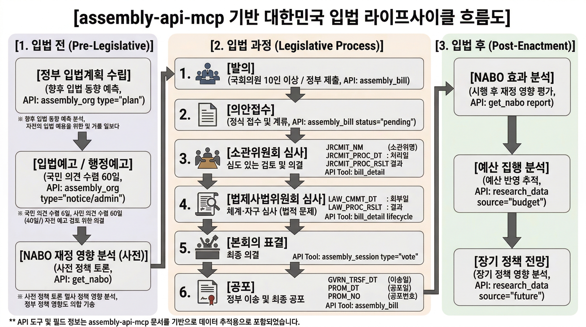

# Legislative Lifecycle — 입법 라이프사이클 완전 가이드

> assembly-api-mcp가 제공하는 입법 데이터로 입법 전/중/후 전 과정을 추적하는 방법을 설명합니다.

---

## 1. Legislative Lifecycle 개요

한국의 입법 절차는 크게 **6단계**로 구성됩니다:

```
정부/국회의원 발의
    ↓
의안접수 → 소관위원회 심사 → 법제사무위원회 심사 → 본회의 표결 → 정부이송 → 공포
```

| 단계 | 설명 | 핵심 질문 |
|------|------|---------|
| **발의** | 정부 또는 국회의원이 법안을 제출 | "누가 발의했나?" |
| **의안접수** |국회가 의안을 접수 | "의안이 정식으로 접수되었나?" |
| **소관위원회** | 해당 위원 상정·심사 | "위원회에서 어떻게 처리되었나?" |
| **법사위** | 법제사법위원회 재적용 심사 | "법적으로 문제가 없나?" |
| **본회의** | 본회의 상정·표결 | "본회의에서 표결되었나?" |
| **공포** | 정부가 법률을 공포 | "언제 공포되었나?" |

assembly-api-mcp는 이 **전 과정**을 데이터로 제공합니다:

| API 소스 | 커버하는 단계 |
|---------|-------------|
| **국회** (open.assembly.go.kr) | 발의 → 접수 → 소관위 → 법사위 → 본회의 → 공포 |
| **국민참여입법센터** (lawmaking.go.kr) | **입법 전** (계획/예고), 국민의견수렴 |
| **국회예산정책처** (nabo.go.kr) | **입법 전** (재정영향 분석), **입법 후** (효과 평가) |

---

## 2. 데이터 커버리지 매트릭스



### 입법 단계별 활용 도구

| 단계 | MCP 도구 | REST API | 주요 필드 |
|------|---------|---------|---------|
| **입법 계획** | `assembly_org(type="lawmaking", category="plan")` | `GET /api/org?type=lawmaking` | lmPlnSeq, lsNm, mgtDt |
| **입법 예고** | `assembly_org(type="lawmaking", category="notice")` | `GET /api/org?type=lawmaking` | ogLmPpSeq, lsNm, stYd, edYd |
| **행정 예고** | `assembly_org(type="lawmaking", category="admin")` | `GET /api/org?type=lawmaking` | ogAdmPpSeq, admRulNm, pntcNo |
| **의안 접수** | `assembly_bill(status="pending")` | `GET /api/bills?status=pending` | BILL_NO, PROPOSE_DT |
| **위원회 심사** | `bill_detail(bill_id, fields=["review", "meetings"])` | `GET /api/bills/{bill_id}/review` | JRCMIT_NM, PROC_RSLT |
| **법사위 심사** | `bill_detail(bill_id, fields=["lifecycle"])` | `GET /api/bills/{bill_id}/history` | LAW_CMMT_DT, RGS_RSLN_DT |
| **본회의 표결** | `assembly_session(type="vote")` | `GET /api/votes` | PROC_DT, CURR_COMMITTEE |
| **국민 참여** | `assembly_org(type="petition")` | `GET /api/petitions` | PTTI_TITL, PTTI_CD |
| **법령 해석** | `assembly_org(type="lawmaking", category="interpretation")` | `GET /api/org?type=lawmaking` | itmNm, joCts |
| **의견제시** | `assembly_org(type="lawmaking", category="opinion")` | `GET /api/org?type=lawmaking` | caseNm, reqOrgNm |
| **NABO 보고서** | `get_nabo(type="report")` | `GET /api/nabo?type=report` | subj, cdNm, pubDt |
| **연구 자료** | `research_data` | `GET /api/research` | 제목, 저자, 발행일 |

---

## 3. Pre-Legislative (입법 전)

입법 전 단계는 법안이 국회에 정식 제출되기 **전**에 해당합니다. 이 단계에서 정부는 입법계획을 수립하고, 예고를 통해 국민의 의견을 수렴합니다.

### 3.1 입법계획 (Legislative Plan)

`assembly_org(type="lawmaking", category="plan")` 또는 CLI:

```bash
# 입법계획 목록 (전체)
npx tsx src/cli.ts lawmaking --type plan

# 특정 연도 입법계획
npx tsx src/cli.ts lawmaking --type plan --key 교육

# 특정 부처 입법계획 (행안부)
npx tsx src/cli.ts lawmaking --type plan --org 1741000
```

**API**: `GET /rest/lmPln`

**의미**: 정부의 연간 입법계획은 다음 해에 발의할 법안을 미리 발표한 것입니다. 이를 추적하면 **향후 입법 동향**을 예측할 수 있습니다.

### 3.2 입법예고 (Legislative Notice)

`assembly_org(type="lawmaking", category="notice")` 또는 CLI:

```bash
# 진행중인 입법예고
npx tsx src/cli.ts lawmaking --type notice

# 종료된 입법예고
npx tsx src/cli.ts lawmaking --type notice --diff 1

# 특정 법령 예고 검색
npx tsx src/cli.ts lawmaking --type notice --keyword 인공지능
```

**API**: `GET /rest/ogLmPp`

**의미**: 법안이 정식 발의되기 전에 공개되어 **60일** 동안 국민 의견을 수렴합니다. 이 단계에서 시민참여가 가능합니다.

### 3.3 행정예고 (Administrative Notice)

`assembly_org(type="lawmaking", category="admin")` 또는 CLI:

```bash
# 진행중인 행정예고
npx tsx src/cli.ts lawmaking --type admin

# 마감된 행정예고
npx tsx src/cli.ts lawmaking --type admin --closing Y

# 특정 자치법규 예고
npx tsx src/cli.ts lawmaking --type admin --keyword 주민자치
```

**API**: `GET /rest/ptcpAdmPp`

**의미**: 중앙행정기관이 아닌 **지방자치단체**의 조례/규칙이 제정/개정될 때 예고됩니다. 시민이 직접 참여할 수 있는 단계입니다.

### 3.4 NABO 재정 영향 분석

`get_nabo(type="report")` 또는 CLI:

```bash
# NABO 보고서 검색
npx tsx src/cli.ts nabo --type report --key 예산

# 특정 분야 보고서
npx tsx src/cli.ts nabo --type report --key 세제

# NABO 정기간행물
npx tsx src/cli.ts nabo --type periodical --key 경제동향
```

**의미**: NABO(국회예산정책처)는 법안에 대한 **재정 영향 분석**, 경제 전망, 세제 분석 보고서를 Publish합니다. 입법 전 정책 Discussion에 활용됩니다.

### 3.5 연구 자료

`research_data(keyword)` 또는 CLI (없음, MCP만):

```typescript
// 연구 자료 통합 검색
research_data({
  keyword: "인공지능 규제",
  source: "all_integrated"  // 도서관 + 입법조사처 + 예산정책처 + 미래연구원
})
```

**의미**: 입법조사처의 법안 분석, 도서관의 학문적 참고자료, 미래연구원의 장기 전망 등을 통합 검색합니다.

---

## 4. Legislative Process (입법 과정)

입법 과정은 의안이 정식으로 국회에 접수되어 심사받는 단계입니다.

### 4.1 의안 접수 (Bill Receipt)

`assembly_bill(status="pending")` 또는 CLI:

```bash
# 계류 중인 의안
npx tsx src/cli.ts pending

# 특정 분야 의안
npx tsx src/cli.ts bills --name 교육 --age 22

# 특정 제안자 의안
npx tsx src/cli.ts bills --proposer 홍길동
```

**API**: `BILLRCP`

**의미**:국회에 접수된 모든 법안이 추적 가능합니다.

### 4.2 소관위원회 심사 (Committee Review)

`bill_detail(bill_id, fields=["review", "meetings"])` 또는 CLI:

```bash
# 의안 상세 조회 (심사 경과 포함)
npx tsx src/cli.ts bill-detail <BILL_ID>
```

**API**: `BILLJUDGE` (심사정보), `BILL_COMMITTEE_CONF` (위원회 회의정보)

**심사 경과 필드**:
- `JRCMIT_NM` — 소관위원회명
- `JRCMIT_PRSNT_DT` — 소관위 상정일
- `JRCMIT_PROC_DT` — 소관위 처리일
- `JRCMIT_PROC_RSLT` — 소관위 처리결과

### 4.3 법사위 심사 (Legislation Committee Review)

`bill_detail(bill_id, fields=["lifecycle"])` — 전체 Lifecycle 포함:

```bash
# 전체 심사 경과 확인
npx tsx src/cli.ts bill-detail <BILL_ID>
```

**lifecycle 필드** (ALLBILL API):
```
소관위원회 → 법제사務위원회 → 본회의 → 정부이송 → 공포
```

| lifecycle 필드 | 의미 |
|--------------|------|
| `JRCMIT_NM` | 소관위원회 |
| `JRCMIT_PRSNT_DT` | 소관위 상정일 |
| `LAW_CMMT_DT` | 법사위 회부일 |
| `LAW_PROC_RSLT` | 법사위 처리결과 |
| `RGS_RSLN_DT` | 본회의 의결일 |
| `GVRN_TRSF_DT` | 정부이송일 |
| `PROM_DT` | 공포일 |
| `PROM_NO` | 공포번호 |

### 4.4 본회의 표결 (Plenary Voting)

`assembly_session(type="vote")` 또는 CLI:

```bash
# 본회의 표결 결과
npx tsx src/cli.ts votes

# 특정 법안 표결
npx tsx src/cli.ts votes --bill-no 2204567

# 최근 처리 의안
npx tsx src/cli.ts recent
```

**API**: `VOTE_BY_BILL` (의안별 표결), `PLENARY_AGENDA` (부의안건)

### 4.5 국민의 참여 (Public Participation)

```bash
# 청원 검색
npx tsx src/cli.ts pending  # 계류 중

# 법령 해석례 검색
npx tsx src/cli.ts lawmaking --type interpretation --key 자동차

# 의견제시 사례
npx tsx src/cli.ts lawmaking --type opinion
```

**의미**: 국민은 청원, 법령 해석에 대한 의견, 행정예고에 대한 의견제시 등을 통해 입법에 직접 참여할 수 있습니다.

---

## 5. Post-Enactment (입법 후)

법안이 공포된 후에도 assembly-api-mcp로 후속 분석이 가능합니다.

### 5.1 NABO 효과 분석

`get_nabo(type="report")`로 법안 시행 후 효과를 분석합니다:

```bash
# 특정 분야 재정 분석
npx tsx src/cli.ts nabo --type report --key 복지 --page 1

# NABO 정기간행물 (경제동향)
npx tsx src/cli.ts nabo --type periodical --key 경제동향
```

**의미**: NABO는 법안 시행 후 **예산 집행 분석**, **재정 영향 평가**를 Publish합니다.

### 5.2 예산 집행 분석

`research_data(source="budget")` 또는 MCP:

```typescript
research_data({
  keyword: "교육예산",
  source: "budget"
})
```

**의미**: 예산정책처의 예산 분석 자료로 법안에 따른 **예산 반영**을 추적합니다.

### 5.3 장기적 정책 전망

`research_data(source="future")`:

```typescript
research_data({
  keyword: "디지털 전환",
  source: "future"
})
```

**의미**: 국회미래연구원의 장기 정책 전망 연구로 입법의 **장기적 영향**을 분석합니다.

---

## 6. 활용 시나리오

### 시나리오: "AI 규제 법안" 전 생애 추적

```
[1단계] 입법 전
─────────────────────────────────────────────────
# 政府의 年度입법계획에 AI 규제 관련 법안이 있나?
npx tsx src/cli.ts lawmaking --type plan --key AI
→ 결과: "AI 국가전략법 제정계획" 있음

# 입법예고 단계인지 확인
npx tsx src/cli.ts lawmaking --type notice --keyword 인공지능
→ 결과: "인공지능(AI) 규제법안" 예고 중 (의견수렴 기간)

# NABO에서 AI 재정 영향 분석 자료 확인
npx tsx src/cli.ts nabo --type report --key 인공지능
→ 결과: "AI 기술발전이 노동시장에 미치는 영향" 보고서 (2024)

─────────────────────────────────────────────────

[2단계] 입법 과정
─────────────────────────────────────────────────
# 국회에 접수된 AI 규제 관련 의안 검색
npx tsx src/cli.ts bills --name AI --size 20

# 특정 의안의 심사 경과 추적
npx tsx src/cli.ts bill-detail <BILL_ID>
→ 결과:
  - 소관위: 과학기술정보위원회 (2024-03-15 상정)
  - 법사위: 2024-04-20，처리중
  - 본회의: 표결 대기

# 본회의 표결 결과
npx tsx src/cli.ts votes --bill-no 2201567
→ 결과: 2024-05-01 可決

─────────────────────────────────────────────────

[3단계] 입법 후
─────────────────────────────────────────────────
# 공포 후 NABO 효과 분석
npx tsx src/cli.ts nabo --type report --key AI규제법
→ 결과: "AI규제법안 시행에 따른 재정영향 분석" (2025)

# 예산 집행 분석
# research_data(source="budget", keyword="AI")
→ 결과: "디지털 전환 예산 투자 계획" (2025)

# 미래연구원 장기 전망
# research_data(source="future", keyword="AI")
→ 결과: "AI 기술 발전 전망과 정책적 대응" (2030)
```

---

## 7. MCP 도구 Quick Reference

### Legislative Lifecycle 관련 도구 (Lite + Full)

| 도구 | 프로필 | 용도 |
|------|--------|------|
| `assembly_bill` | Lite | 의안 검색/추적/통계 |
| `assembly_org` | Lite | 위원회/청원/입법예고 (lawmaking type 포함) |
| `assembly_session` | Lite | 일정/회의록/표결 |
| `bill_detail` | **Full** | 의안 심층 (심사/이력/회의/생애주기) |
| `research_data` | **Full** | 도서관/입법조사처/예산정책처/미래연구원 통합 |
| `get_nabo` | **Full** | NABO 보고서/정기간행물/채용 |

### Key 파라미터

| 도구 | 파라미터 | 설명 |
|------|---------|------|
| `assembly_org` | `type="lawmaking"` | 국민참여입법센터 API전환 |
| `assembly_org` | `category="plan\|notice\|admin\|interpretation\|opinion"` |입법단계 구분 |
| `assembly_bill` | `status="pending\|processed\|recent"` | 의안 상태 필터 |
| `assembly_bill` | `keywords` | 의안명 키워드 추적 |
| `assembly_session` | `type="vote"` | 표결 조회 |
| `bill_detail` | `fields=["lifecycle"]` | 전체 입법 생애주기 |
| `get_nabo` | `type="report\|periodical\|recruitments"` | NABO 자료 유형 |
| `research_data` | `source="all_integrated"` | 4개 기관 통합 검색 |

---

## 8. API 소스 요약

| 소스 | URL | 주요 데이터 |
|------|-----|-----------|
| **국회** (open.assembly.go.kr) | 열린국회정보 | 의안/국회의원/일정/회의록/표결/청원 |
| **국민참여입법센터** (lawmaking.go.kr) | opinion.lawmaking.go.kr | 입법계획/예고/행정예고/법령해석/의견제시 |
| **국회예산정책처** (nabo.go.kr) | nabo.go.kr | 재정분석/경제전망/예산보고서 |
| **국회도서관** (nanet.go.kr) | nanet.go.kr | 학술 자료/Government 문서 |
| **입법조사처** | open.assembly.go.kr |입법조사 보고서 |
| **예산정책처** | open.assembly.go.kr | 예산 분석 자료 |
| **미래연구원** | open.assembly.go.kr | 장기 정책 전망 |

---

## 9. 이 문서에 대하여

**최종 업데이트**: 2026-04-12

**관련 문서**:
- [README.md](../README.md) — 프로젝트 전체 개요
- [docs/tool-mapping.md](tool-mapping.md) — MCP 도구 ↔ API 매핑
- [docs/api-catalog.md](api-catalog.md) —국회 API 276개 전체 목록
- [USECASE.md](../USECASE.md) — 활용 사례 100선
